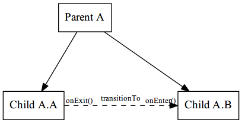
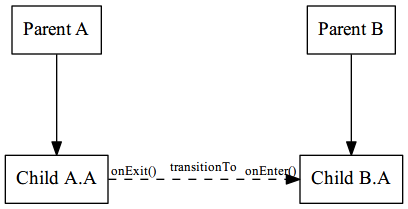

# ember-route-promise-chain [](https://travis-ci.org/BBVAEngineering/ember-route-promise-chain) [](https://badge.fury.io/gh/BBVAEngineering%2Fember-route-promise-chain) [](https://david-dm.org/BBVAEngineering/ember-route-promise-chain)

[](https://nodei.co/npm/ember-route-promise-chain/)

A tiny ember-cli addon to enable promise-based hooks upon entering or exiting routes.

## Usage

Install the addon with ember-cli.

```javascript
ember install ember-route-promise-chain
```

Create a new [instance-initializer](https://guides.emberjs.com/v2.14.0/applications/initializers/) and inject the addon.

```javascript
import injectPromiseChain from 'ember-route-promise-chain';

export function initialize(appInstance) {
  injectPromiseChain(appInstance);
}

export default {
	name: 'route-promise-chain',
	initialize
};
```

In order to define a new hook, you can setup your routes as follows:

```javascript
export default Ember.Route.extend({

  onEnter() {
    return [new Promise(resolve => resolve())];
  },

  onExit() {
    return [new Promise(resolve => resolve())];
  }

});
```

Both hooks are executed when the transition finishes. On leaving routes, `onExit` hooks are executed, and on entering routes `onEnter` hooks are executed.



Also, you can setup conditions for your hook to execute. Every condition is evaluated just before `promise` is executed, if the condition returns `false`, `promise` won't be executed.

```javascript
export default Ember.Route.extend({

  onEnter() {
    return [{
      condition: () => true,
      promise: new Promise(resolve => resolve())
    }];
  }

});
```

On nested routes, `onExit` hooks are executed in `child-parent` order whilst `onEnter` hooks are executed in `parent-child` order. So, for example, in the next figure,



hooks, are executed as follows:

* onExit: Child A.A -> Parent A.
* onEnter: Parent B -> Child B.A.

Or, as follows:

* First, Child A.A, onExit method.
* Next, Parent A, onExit method.
* Next, Parent B, onEnter method.
* Last, Child B.A, onEnter method.

Every hook must return an array with objects with `promise` property. Optionally, a `condition` property can be used to define conditions for the object. This objects are known as `chains`.

Hooks `onEnter` and `onExit`, and properties `promise` and `condition` can be [async](https://developer.mozilla.org/en-US/docs/Web/JavaScript/Reference/Statements/async_function) functions.

```javascript
export default Ember.Route.extend({

  async onEnter() {
    return [{
      condition: () => !this.get('fetched'),
      promise: async () => {
        const response = await this.fetch();

        this.set('fetched', true);
      }
    }];
  }

});
```

When a chain (`condition` or `promise` properties) returns a rejection, next chains on same hierarchy are not executed.

When a chain triggers a transition to another route, next chains on all hierarchies are not executed.

Extending routes can be handy to define some behaviour in order to set promise chains dependencies. On the next example, `my-promise` chain will only execute if `promise-base` chain is not going to be executed.

```javascript
// File: base.js
export default Ember.Route.extend({

    async onEnter() {
      return [{
        name: 'promise-base',
        condition: () => this.get('shouldFetch'),
        promise: () => this.fetch()
      }];
    }

});

// File: my-route.js
export default BaseRoute.extend({

    async onEnter() {
      const chains = await this._super();

      return [{
        name: 'my-promise',
        condition: () => !chains[0].condition(),
        promise: () => this.myFetch()
      }].concat(chains);
    }

});
```

## Installation

* `git clone <repository-url>` this repository
* `cd ember-route-promise-chain`
* `npm install`

## Running Tests

* `npm test` (Runs `ember try:each` to test your addon against multiple Ember versions)
* `ember test`
* `ember test --server`

## Building

* `ember build`

For more information on using ember-cli, visit [https://ember-cli.com/](https://ember-cli.com/).
